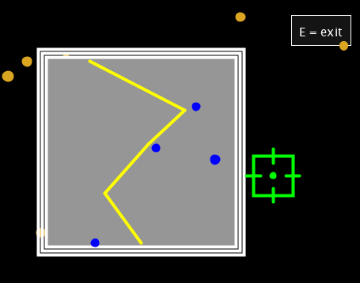
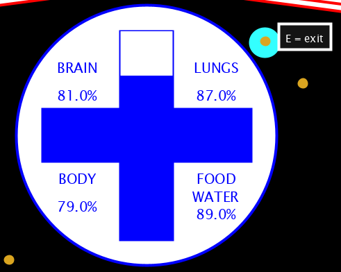
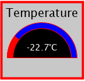
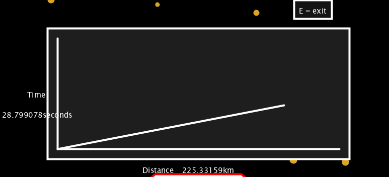
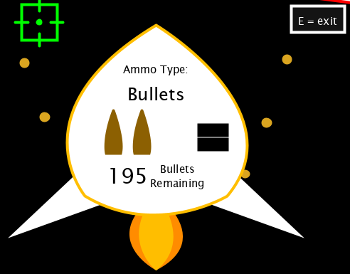
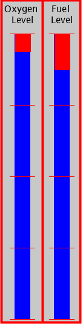
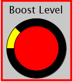
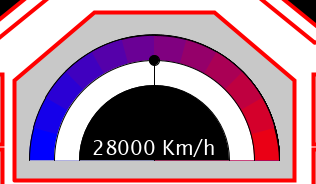
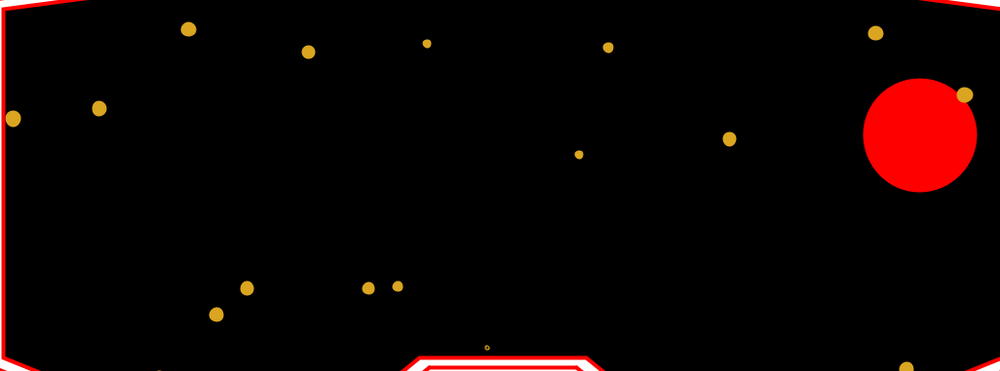

# SciFi UI Project

Name: Christopher Brady

Student Number: C17300916


# Description of the assignment

My User Interface was originally inspired by the idea of Iron Man. I wanted to create an interface that could be seen inside a helmet of some sort of flying suit through space. I started this project by designing the space in the background, this took a lot of time as I decided to use random variables for the colours of the planets and also initially the size. 

# Instructions
I added in some visual instructions to my system also but the instructions for my system are as follows:
" SPACE " ==> applies boost to the UI
" S "     ==> shoots bullets which are kept tract of in Ammo
" e " ==> will exit a button that has been pressed
clicking the target on a button will open them


### I added in some visual instructions to my system also but the *button* instructions for my system are as follows:

- *SPACE* ==> Applies boost to the UI, you should visually be able to see the stars / planets move faster, the fuel level should decrease faster, the boost level should also decrease, and the speedometer should increase to it's boost speed.

- *S*     ==> Allows the user to shoot a planet when the target is on it, you should see the planet dissapear and the bullet count decrease in Ammo.

- *e*     ==> Enables a user to exit a pressed button like map, you should see the map dissapear.

- *mouseClick* ==> on a button will open them and display different objects eg. a map

### Different Features that can be seen :

- Map: This generates a random route ( in yellow ) and shows planets that it has to go by in blue which spawn in random spots and at random sizes.


- Health: This shows the overall health of the user in the system. The health automatically decreases over time in relation to four different properties: Brain ( *This goes down as the person is alone in space and his mental health would, in theory, decrease over time because of this sense of abandonement* ), Body ( *This goes down due to the assumption that being in space in just a metal suit will have a negative effect on your body* ), Lungs( *As the level of oxygen is very low and the change of atmospheric pressure is so prominent, I thought lungs would be an appropriate measure of health* ) and finally, Food & Water ( *This is an obvious health attribute as these levels are the most important for a humans health* ). These attributes decrease in tandem and are shown visually through a cross.

 
- Temperature: This feature tells the temperature of the suit. For this interface I decided to make it increment and decrement randomly and rapidly. My decision for this was to simulate the unpredictable temperatures in space where if close to a planet or stars it could be extremely warm and when in deep space it could be extremely cold. 


- Distance: This feature displays a distance, time graph and resets every time it is spawned. This is also affected by the boost as the distance increments faster whenever boost is used.


- Ammo: This button, when clicked, displays the amount of ammo the user has remaining. In this interface the user can shoot and destroy planets by pressing s, which decrements the amount of ammo simultaneously.


- Fuel and Oxygen: These two objects appear side by side in the system and allow the user to keep track of the amount of fuel and oxygen they have left. They both decrement over time, and if one runs out the interface ends. The fuel decreases faster and also reacts to when the boost is used as it runs down faster.


- Boost: This fesature is one of the core objects of this system as it affects so many others when used. It appears on the left side of the interface and automatically fills itself and can be used at any time if SPACEBAR is pressed which decreases it. It acts as if it is charged by the system while running. Another cool feature is the fact that it highlights yellow when full.


- Speedometer: This feature can be seen at the bottom centre of the interface and keeps track of the speed the user is going. To come up with a rough average speed I did some research on spaceships and the speed they go which is where i came up with the steady travelling speed of 28000km/h. I was going to allow this to change but as I figured there would be no resistance from air or gravity in space, I allowed the speed to stay uniform unless the boost was pressed. If the boost is pressed the speedometer increments to 42000km/h, an increase of 50%.


- The Background (Stars and Planets): For the background which is set in space, I designed Planets and Stars which spawn and despawn automatically based on time passed. The stars spawn more frequent but don't increase in size as much as planets as they can be millions of kilometres away. I implemented them so they travel sideways across the screen to simulate the user going forward through space. Another feature of the stars is that they spawn in random Y positions accross the centre of the screen and travel diagonally in a direction relevant to this spawn position. The planets are similar in their movement but they travel at a faster base speed and increase in size quicker. Another cool feature of the planets, is that they spawn with different colours randomly from an array of colours which i created. Both of these objects are affected by the boost as their speed of movement increases across the screen when the boost is pressed, which also simulates the user moving faster.



# How it works

# What I am most proud of in the assignment
I was successfully able to connect all of the objects through inheritence and ---- which allowed them to work simultaneously and react to certain events simultaneously 
too. 

# Markdown Tutorial

This is *emphasis*

This is a bulleted list

- Item
- Item

This is a numbered list

1. Item
1. Item

This is a [hyperlink](https://github.com/C17300916/SciFiUI)

# Headings
## Headings
#### Headings
##### Headings

This is code:

```Java
public void render()
{
	ui.noFill();
	ui.stroke(255);
	ui.rect(x, y, width, height);
	ui.textAlign(PApplet.CENTER, PApplet.CENTER);
	ui.text(text, x + width * 0.5f, y + height * 0.5f);
}
```

So is this without specifying the language:

```
public void render()
{
	ui.noFill();
	ui.stroke(255);
	ui.rect(x, y, width, height);
	ui.textAlign(PApplet.CENTER, PApplet.CENTER);
	ui.text(text, x + width * 0.5f, y + height * 0.5f);
}
```

This is an image using a relative URL:


This is an image using an absolute URL:


This is a youtube video:

[](https://www.youtube.com/watch?v=J2kHSSFA4NU)

This is a table:

| Heading 1 | Heading 2 |
|-----------|-----------|
|Some stuff | Some more stuff in this column |
|Some stuff | Some more stuff in this column |
|Some stuff | Some more stuff in this column |
|Some stuff | Some more stuff in this column |

